# "FlexDiffuse"
## *An adaptation of Stable Diffusion with Image Guidance.*

## TLDR

You can find the code for all of this in `guidance.py` feel free to copy and
reference as you desire, I provide no license or warranty. You can probably
`pip install` this repo as a module and reference the file that way too if
you'd like, I plan to make some additional improvements.

### What this is

- Methods to map styles of an image using CLIP image embeddings to the CLIP text
embeddings after encoding the prompt to allow reaching new spaces in prompt
guidance.
- A hopefully easy to use webui for generating images

### What this isn't

- **Img2Img**: The methods shown in this repo apply to image guidance, not the
orgin, and in this demo I show how Img2Img can be used in combination.
- **Textual Inversion**: Requires training / tuning a model, this just modifies
embeddings, and is only good at some style transfer not reconstructing subjects,
as Textual Inversion has been demonstrated to do. I would like to integrate
Textual Inversion into this demo at somepoint.

### To Run the demo

0. Ensure you have at least **python 3.10** installed and activated in your env.
1. `pip install -r requirements.txt`
2. `python ui.py --dl`
3. The --dl param can be omitted after first run, it's used to connect to
    huggingface to download the models, you'll need to setup your account and
    all that, see https://huggingface.co and Stable Diffusion there for more
    details on how to get access.

### Image guidance method parameters

- **Clustered** - This increases or decreases the association of the
    CLIP embeddings with their strongest related features and the features
    around them with a linear reduction in weight.
- **Linear** - This increases or decreases the association of the trailing
    embedding features. In StableDiffusion this means more stylistic features,
    where as the front-most features tend to represent the more major concepts
    of the image.
- **Threshold** - This increases or decreases the similarity
    of associated features above or below a relative threshold defined by
    similarity.. average similarity ( across all features ) by default.

### "Help, my image looks like garbage"

Could be that CLIP doesn't have a good interpretation of it or that it doesn't
align well with the prompt at all.
You can set **Threshold** and **Clustered** guidance to 0.0-0.1 and try to
increment from there, but if there's no alignment then it's probably not a
good fit at all.. **Linear** Style guidance should be fine to use though in these
cases, though you may still get mixed results, they wont be as bad as with the
other options.

In general I've found these methods work well to transfer styles from portraits
( photos, or artificial ) and more abstract / background scenes.
CLIP alone does not have a great understanding of the physical world, so you
wont be able to transfer actions or scene composition.

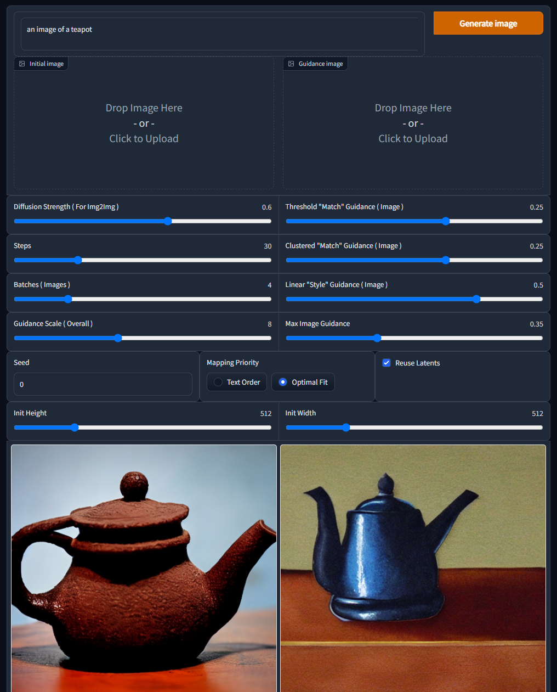

## Abstract

Stable Diffusion is great, text prompts are alright... While powerful, they
suck at expressing nuance and complexity; even in our regular speech we often
underexpress meaning due to the encoding cost ( time, energy, etc. ) in our 
words and instead we often rely on environmental or situational context to give
meaning.
CLIP text embeddings suffer from this same problem, by being a sort of average
mapping to image features. Stable Diffusion by their use has contraints on its
expressive ability, concepts are effectively "lost in translation", as it's
constrained by the limited meaning derived from text.
In this repo I demostrate several methods that can be used to augment text
prompts to better guide / tune image generation; each with their own use case.
This differs from Img2Img techniques I've currently seen, which transform
( generate from ) an existing image. I also show how this traditional
Img2Img technique can be combined with these image guidance methods.

## Disclaimer

### Language

I use terms like *embedding*, *features*, *latents* somewhat loosely and
interchangeably, so take that as you will. If I mention *token* it could also
mean the above, just of a text *token* from CLIP. If I mention *mappings* it
probably relates somewhat to the concepts of *attention*, as *attention* is a
core component of these transformer models, and this entire work is based on
mapping to an *attention* pattern or *rythm* of text *embeddings* that Stable
Diffusion will recognize, so that image *features* can be leveraged in image
generation guidance, not just as source material.

### About Me

I am by no means an expert on this, I've only been doing ML for a couple years
and have a lot to learn, though I do have a lot of translateable skills after
15+ years of writing code and other things...
I may make assumptions in this work that are incorrect, and I'm always looking
to improve my knowledge if you'll humor me.

## Process

### The Problem

Though Stable Diffusion was trained with images and descriptions of certain 
characters and concepts, it is not always capable of representing them through
text.

For example just try and generate an image of Toad ( The Mario Character),
the closest I've gotten is with `toad nintendo character 3d cute anthropomorphic
mushroom wearing a blue vest, brown shoes and white pants` and while this gets
things that kind of look like him, I have yet to generate one.
Toad should exist somewhere within the Stable Diffusion model, but I can't guide
it to create him.

Why... Well in this case `Mario` is such a strong signal putting his name in any
prompt will hijack it, even `Nintendo` itself is such a strong term compared to
`Toad` himself... and `Toad` alone is overloaded, because it's used to represent
and amphibian...

Beyond hidden characters there are plenty of scenes or concepts that Stable
Diffusion can't generate well because of prompts, and sure if you cycle through
hundreds or thousands of seeds you might eventually land on the right one,
but what if there was a way, beyond prompts alone to guide the diffusion
process...

*CLIP ( The model used by Stable Diffusion to encode text ), was desinged to
encode text and images into a similar embedding space. This allows text and
images to be linked, we can say if these embeddings look x% similar to these
other embeddings, they're likely to be the same thing.*

So why not use CLIP image embeddings to guide image generation as well?
- Turns out that the embeddings for images are in a different structure than
the text ones.
- The structure of the text embeddings provides meaning to Stable Diffusion
through what I'm assuming to be the attention mechanism of transformers.
- Giving unstructured or sparse embeddings will generate noise, and textures.

The easiest way I could give the image embeddings structure, was to map them to
text, I had done this before when using CLIP directly, so I thought I'd try it
here, and best fit the image embeddings to the text embeddings encoded from the
text prompt.

At first I saw noise and got a little discouraged, but then thought maybe I
should amplify based on similarity because I'm kind of in the same boat as
before as not all image features mapped well to the text embeddings, there were
usually just a handful out of all **77**...

### Linear integration

The first method I tried was a sort of linear exchange between image embeddings
and text embeddings ( after they were mapped with best fit ). I knew Stable
Diffusion gives the most attention to the front of the prompt, and was able
to validate that by seeing my image get scrambled when I amplified the best
fit image embeddings at the front vs the back.

The back seems to be more of a "Style" end, where all the embeddings contribute
to more image aesthetic than anything.. to the point where they could probably
be zeroed and you'd still get nice images.

So I settled on just doing a reverse linspace from 0-1 from the back of the
embedding tensor all the way to the front, and this actually had some really
nice results.. it would translate photo aesthetics pretty well, and even some
information about background. So this is what I kept as the "Linear" parameter
you'll see in the code.

### Clustered integration

After my linear experiments I thought maybe I should just try mapping to the
features that there was a strong connection to, and just modifying the features
around it a bit. This started as mutating from either the peaks or the valleys
of the mapped features ( mapped by similarity )

I found that mutating the valleys messed things up, as the features didn't have
a strong connection, only subtle changes were acceptable, so I decided to remove
the valley portion and just focused on maximizing the translation at the peaks.

Continued experiments find that this method is not great, but it is kind of a
neat way of doing some residual tweening between prompt and image like linear.

### Threshold integration

The idea of this is that by setting a global threshold for mapped features you
could tune just the embeddings that passed the threshold, this is somewhat how
the clustered integration works, but not quite; this would be a little more
direct and I think would give really good results, especially in a multi-image
guided case.

### Prompt Mapping

The idea here was to selectivly map image concept based on another prompt.
This is done by relating a "Mapping Concepts" prompt to the image, and then
relating that prompt to the base prompt with a high alignment threshold.
This method can work quite well, and it gives much more control vs the direct
threshold mapping method.

### The header embedding and direct image guidance

I've learned that some of my earlier experiments mapping to the front were most
likely ruined by what I now refer to as the dreaded header embedding...
This thing would ideally not exist, and should probably just be hardcoded as
so far, it doesn't really seem to change...
It is the first embedding, and it seems to be consistent among a few prompts I
tested, altering it causes a lot of noise and really messes with guidance.
My guess "not being well versed in transformers" is that it is used as an anchor
for the attention mechanism allowing the guidance of the pattern or rythm in
the space of numbers after it...
If I am right about it.. it would be nice to have it removed from the model
or hardcoded in forward functions.

So anyway, by skipping this token, and not modifying it, modification of the
earlier embeddings from index 1 onwards actually works well, and I have included
a demonstration of pure image prompt guidance, and shifted all embedding
modification to ignore index 0..

Direct image guidance currently functions off the "pooling" embedding as the
primary embedding, which is probably not ideal, the higher index "hidden"
embeddings will probably lead to more image features when placed in series,
as the pooling embedding might have too much compressed meaning, as it seems
to generate very random things..

This may also just be more of an issue with the pattern or rythm of the CLIP
embeddings from image being nowhere near text.. and some kind of sequencer
is needed, like maybe BLIP..

## Experiments

Everything here I've sourced from myself or https://lexica.art/ so there
shouldn't be any copyright issues...

All experiments were run with default settings and **seed** 1337 unless
otherwise mentioned:
- Diffusion Stength = 0.6
- Steps = 30
- Batches = 4
- Guidance Scale = 8
- Init Height & Width = 512
- Threshold Match Guidance = 0.25
- Clustered Match Guidance = 0.25
- Linear Style Guidance Start = 0.0
- Linear Style Guidance End = 0.5
- Max Image Guidance = 0.35
- Optimal Fit Mapping with reused Latents

### "Deer colorful, fantasy, intricate, highly detailed, digital painting, hq, trending on artstation, illustration, lovecraftian dark ominous eldritch"

Inspired by: https://lexica.art/?prompt=bf174f36-2be8-475b-8719-76fbf08f6149

#### Base Generation

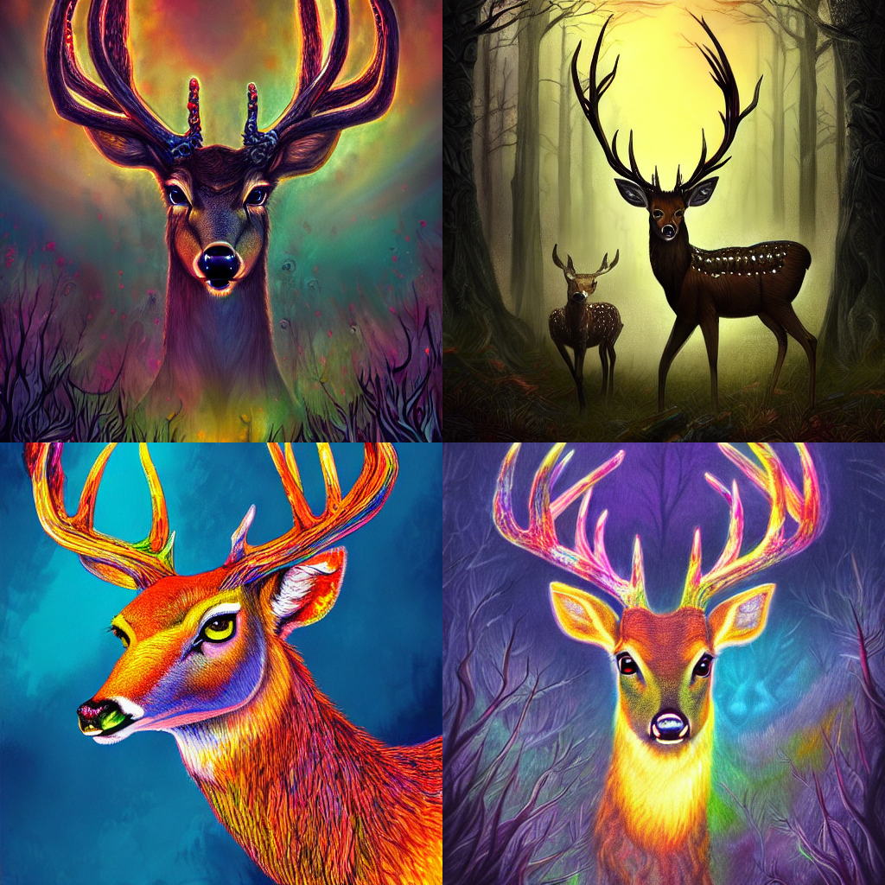

#### Img2Img

This time we'll modify a generated image using the same prompt

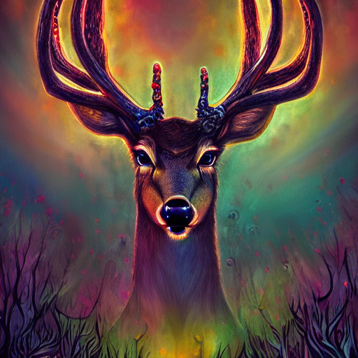

After Img2Img ( Without Image Guidance )

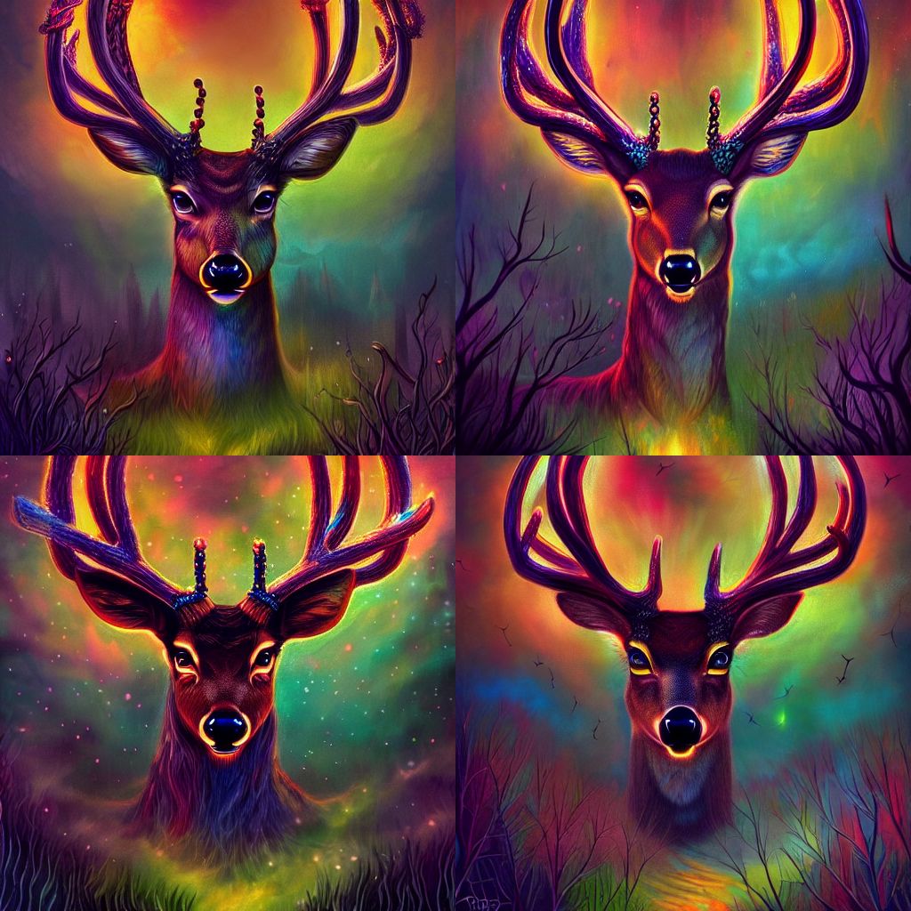

#### Modifier

https://lexica.art/prompt/225c52aa-fd4b-4d17-822e-3721b7eb9c05
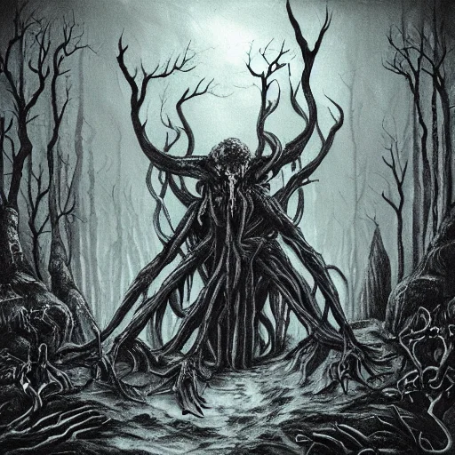

#### Applied with Defaults

Except you actually need this due to it's introduction:
- Threshold Floor = 0.2

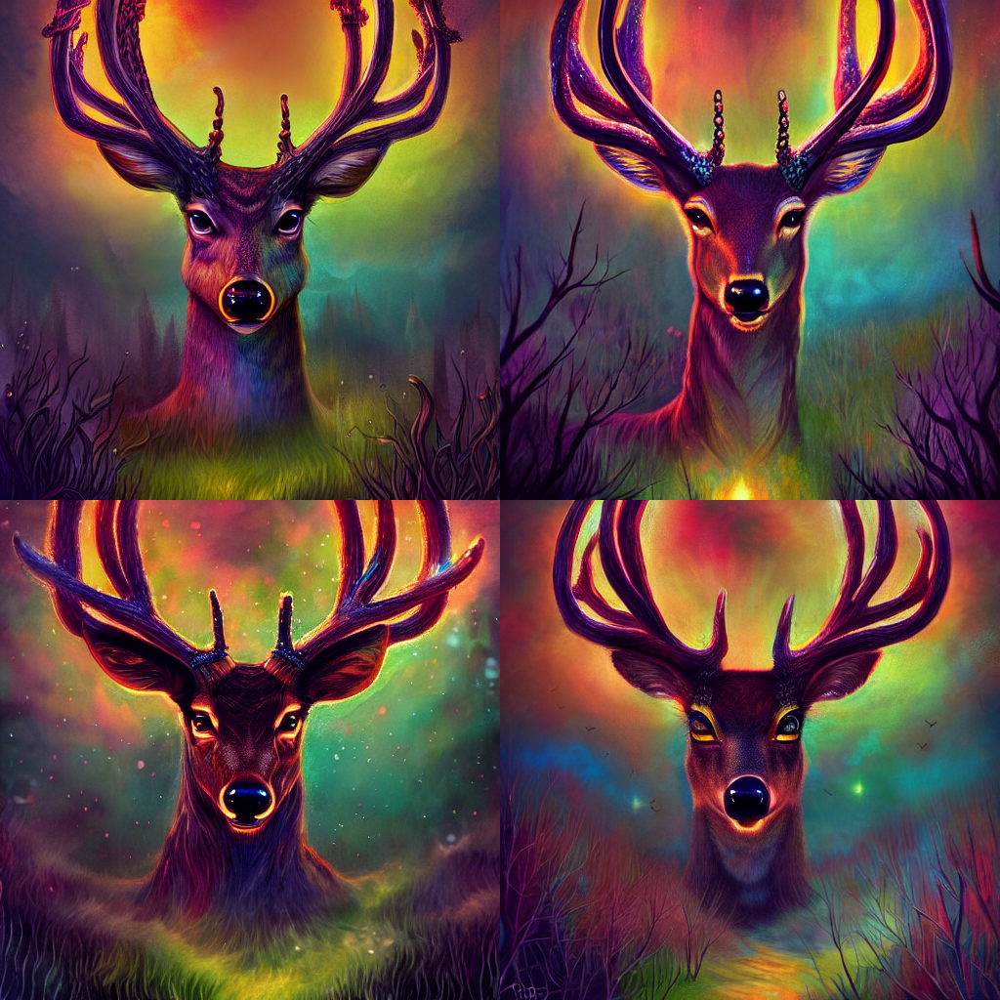

The differences here are extremely subtle, see if you can spot them, this
indicates high alignment with the prompt. Let's amp up the settings a bit.

#### Tuned Settings

- Threshold Mult = 1.0
- Threshold Floor = 0.2
- Clustered = 0.0 ( Turned off cause it gave the deer a warped tree neck )
- Linear = 1.0
- Max Image Guidance = 1.0

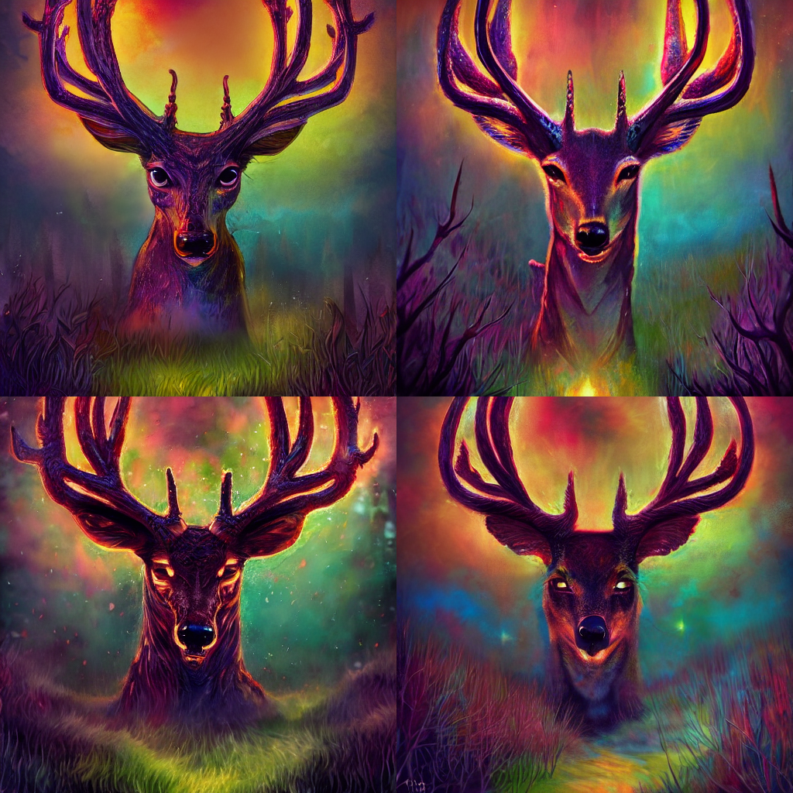

Much spooky!

Threshold generally works better than clustered, but only if there's good
alignment between prompt and image... I need to add a setting to adjust the
actual threshold and not just the intensity. Right now the threshold is
computed as an average of mapped latent similarities, instead it should be
a specific value between, probably around 0.5 ..

Now watch what happens if we just use linear, setting `threshold = 0`

All that spookyness went away, and we only see a slight variation from the
base img2img generation, showing how little the trailing latents have an effect
on the guidance of theses images, which is not always the case.

### Rock Monkey ??? Custom threshold experiment

Using a newly added slider to adjust the threshold, and the modifier image from
the deer experiment and applying it to the turtle prompt and adjusting settings
to:
- Threshold Mult = 1.0
- Threshold Floor = 0.1
- Clustered = 0.0
- Linear = 1.0
- Max Image Guidance = 1.0

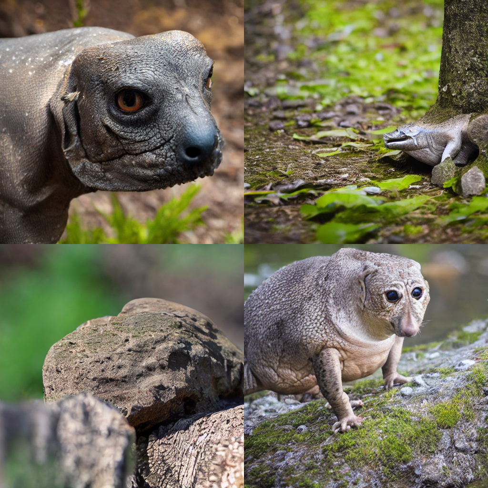

We get whatever this is... showing that sometimes embeddings with a low
similarity of 0.1 - 0.2 ( it was still a turtle at 0.2 ) can still map in and 
generate something.. this isn't always the case. As with the original turtle
modifier image, the wavy noise pattern maps in below a 0.75 threshold and takes
us far away from anything resembling an animal.

To me this points towards a potential mapping of core types of images to
different settings. I could probably judge overall prompt similarity with the
modifier image, as well as test different core classes of images "portrait",
"photo", "painting", "group" .. and with that infer ideal defaults.

### "a creepy tree creature, 8k dslr photo" - Concept Mapping

I added a feature which allows direct mapping matched features through a second
prompt. The prompt does its mapping on the image, which can then be mapped to
the first prompt.

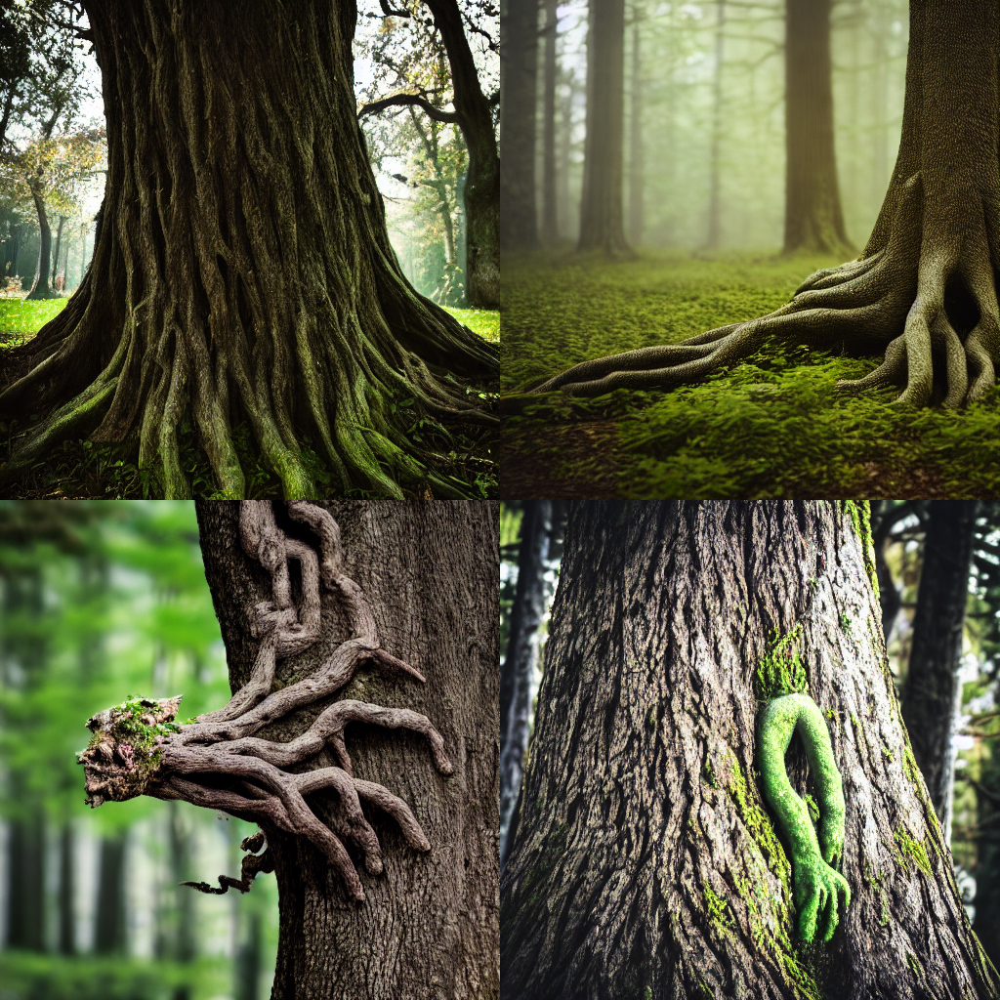

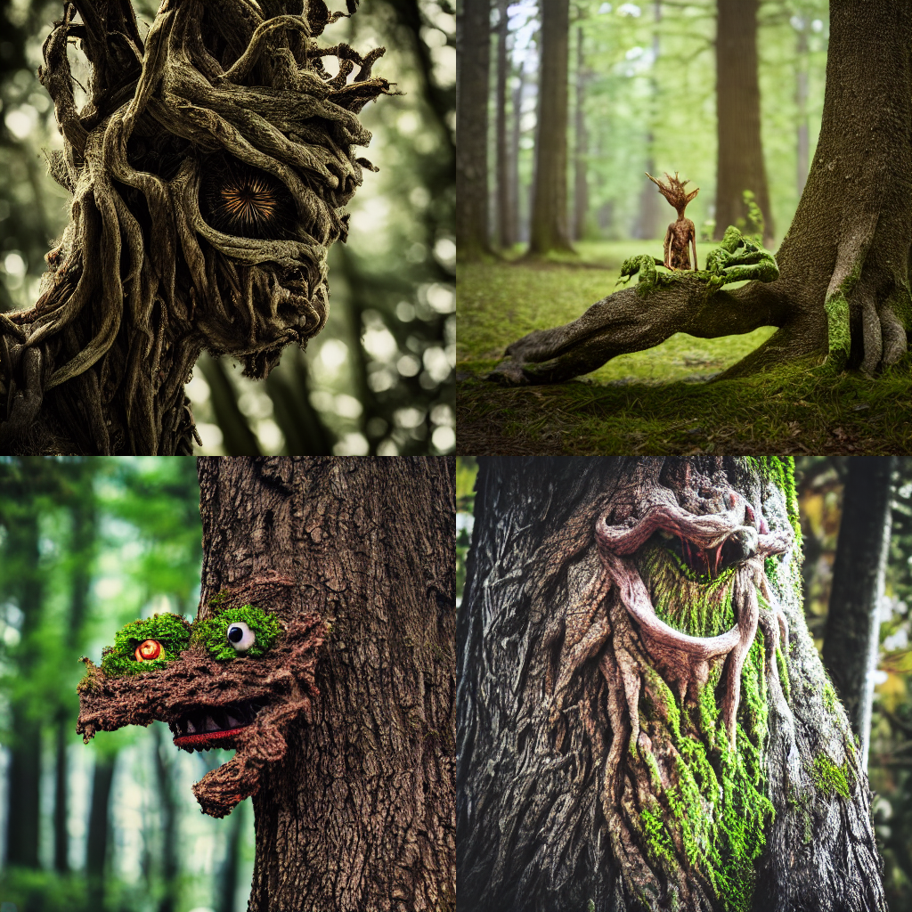

By specifying "creepy tree" in the second prompt and using the modifier image
from the deer experiment, I was able to specifically target and map features
of the guidance image to the base prompt.

For this experiment I used all default settings, but turned the default image
guidance features all to 0:
- Threshold Mult = 0
- Clustered = 0
- Linear = 0
- Max Image Guidance = 0

This concept mapping is currently implemented after all these others as a sort
of override. You do not need to turn those features off, but I did it to
demonstrate.

## Archived Experiments ( Need old version to replicate )
They are broken by the introduction of threshold floor or removal of
modification to the "header" embedding.

### Img2Img Zeus portrait to Anime?
The introduction of threshold floor has broken the exact replication of this
generation, as the auto calculated similarity or alignment used for this is
not enabled as a setting, I believe it is 0.1663 ...

Initial Image:
https://lexica.art/prompt/6aed4d25-a58e-4461-bc7e-883f90acb6ed

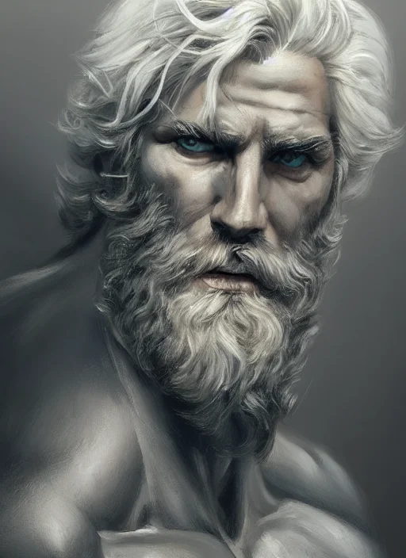

#### Img2Img: "anime portrait of a strong, masculine old man with a curly white beard and blue eyes, anime drawing"

Cranking *Diffusion Strength up to 0.7* here to get more of a transformation
and *Steps to 40*

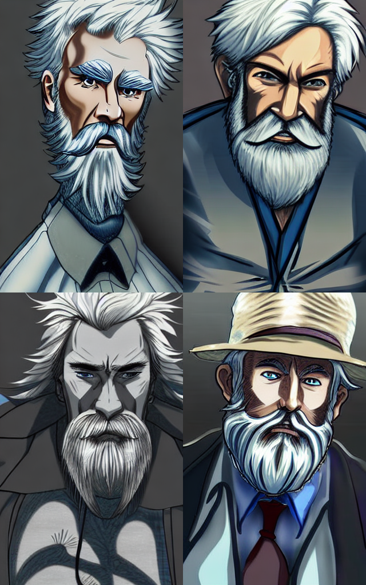

#### Now lets try and get a little more style guidance from an image

https://lexica.art/prompt/82bfb12d-86c7-412f-ab27-d3a08d9017af

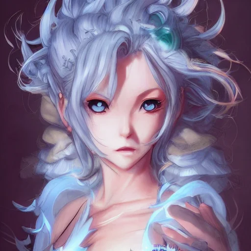

#### Zeus with default Image Guidance

#### Tuned Settings

- Threshold = 1.0
- Clustered = -0.5
- Linear = 1.0
- Max Image Guidance = 1.0

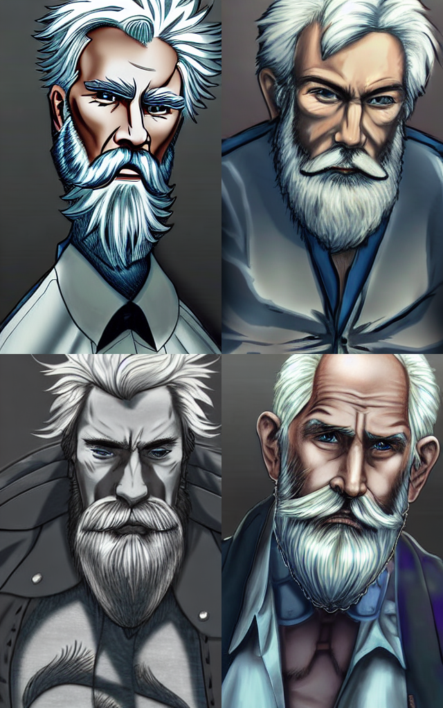

Here we're able to take some of the finer aesthetics and amplify some matching
features.

### "a photo of a turtle, hd 8k, dlsr photo"
The introduction of threshold floor has broken the exact replication of this
generation, as the auto calculated similarity or alignment used for this is
not enabled as a setting, I believe it is 11.37%

#### Base Generation

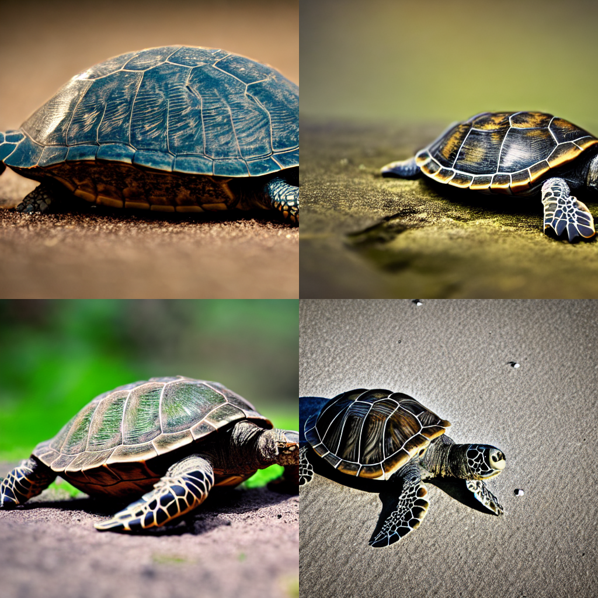

#### Modifier

https://lexica.art/prompt/e1fdbf56-a71c-43eb-ac4b-347bacf7c496
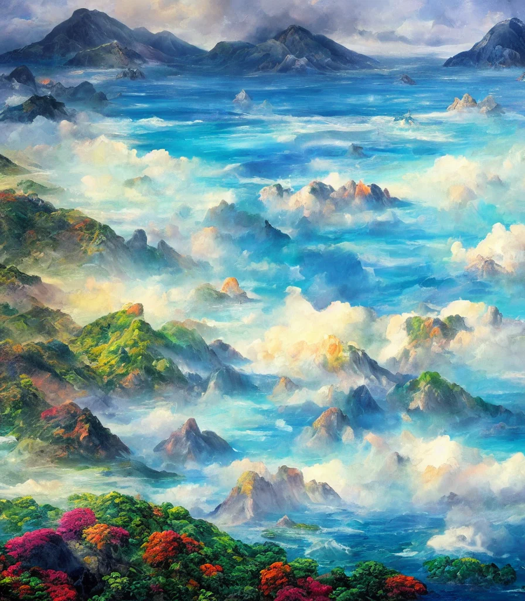

#### Applied with Defaults

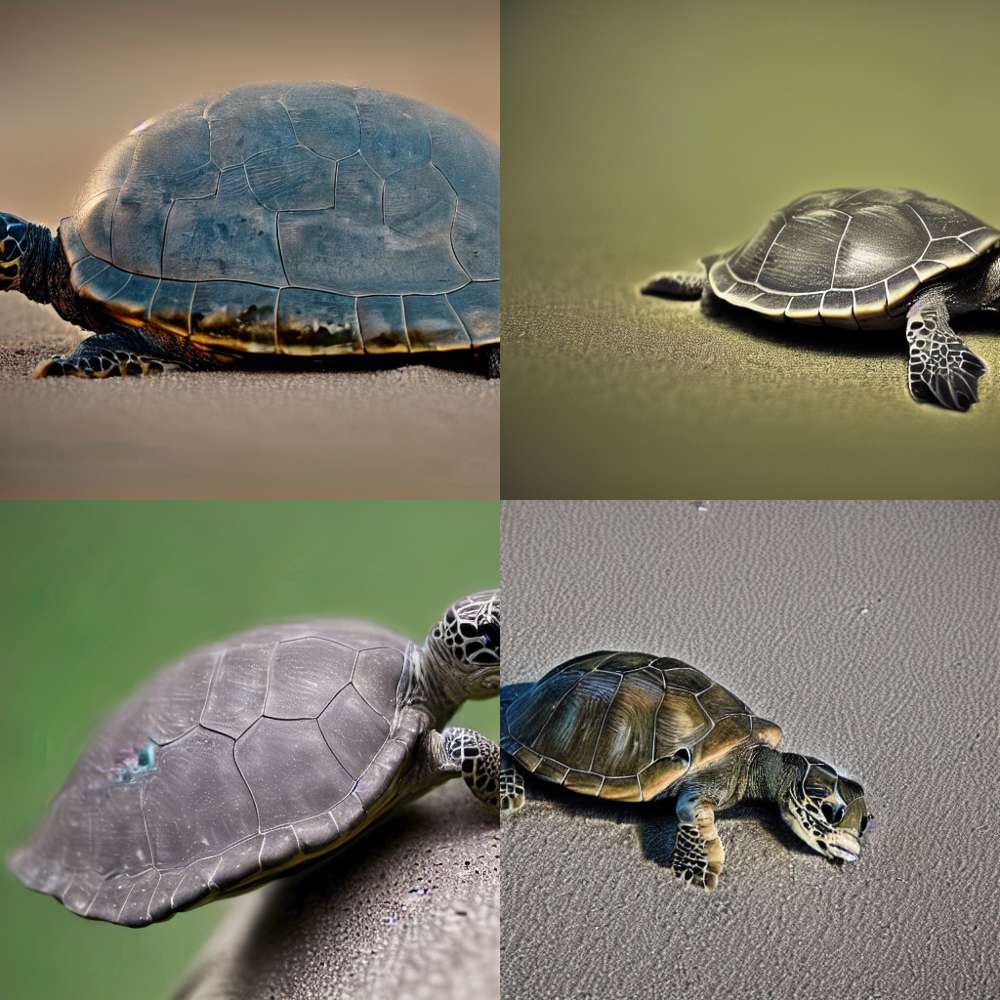

#### Tuned Settings

- Threshold = -0.25
- Clustered = 0.0
- Linear = 1.0
- Max Image Guidance = 1.0

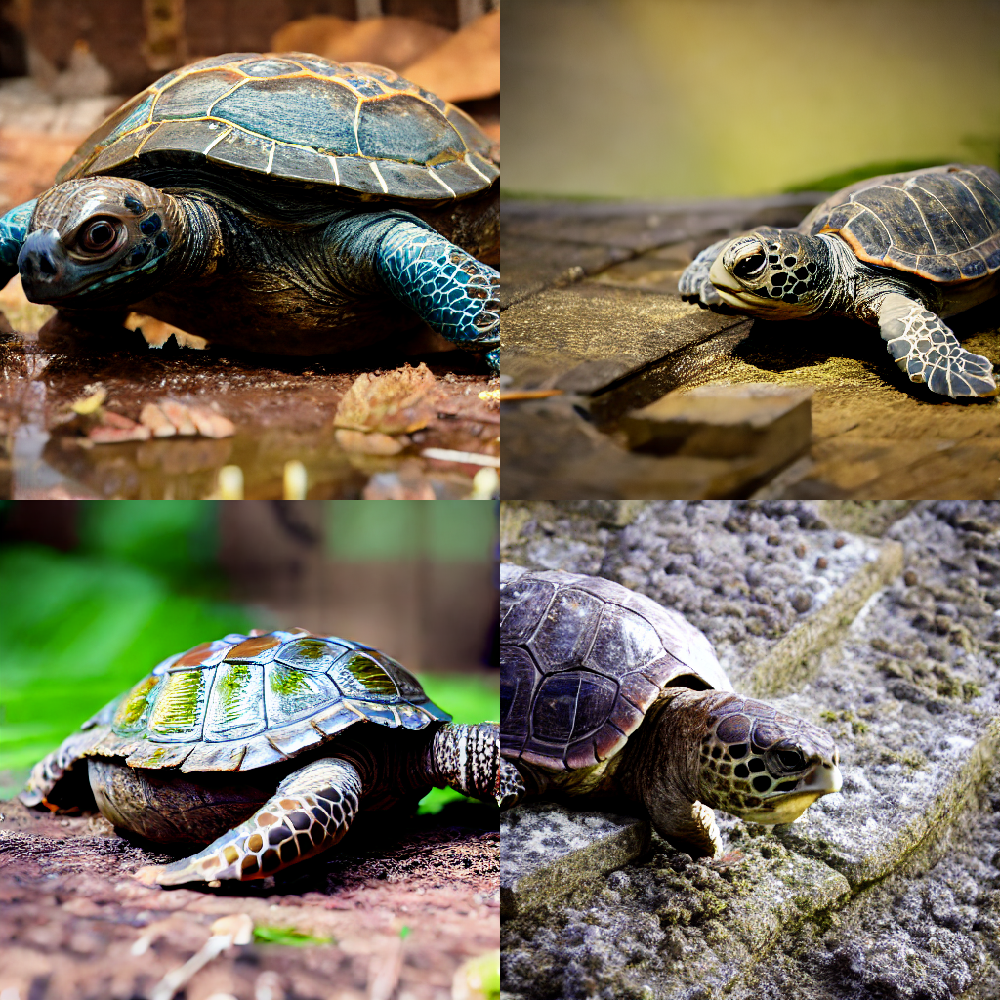

You can see we've guided the generation from this seed in a new direction while
keeping true to the prompt.

Explanation ( Guess ):
- Negative Threshold setting moves us away from matched concepts between prompt
    and image in linear space.
- High Linear setting moves us towards minor stylistic details, fidelity,
    texture, color...

## Future Work

- Cleanup UI
- Intersecting features of multiple images on prompt embeddings.
- Support for negative prompts
- Text based composition research... eventually implement something that can
    replace the need for drawing tool integrations for those comfortable with
    a language ( natural or otherwise ) guided approach.. the ideal end state
    of this may be similar to a programming language:
    - From my friend Dom:
        - https://primer.ought.org/
        - https://arxiv.org/abs/1909.05858
        - "Transformer-XL and retreival augmented transformers have mechanisms
            for packing more information into embeddings by retrieving context"
        - "You can also take the pyramid approach that is popular in retreival
            and summarization where you have multiple seperate embeddings and
            have a “fusion” component that is trained to compose them"
- Integrate Textual Inversion in an easy to use way
- Dissect BLIP and StableDiffusion training, and build an algorithm or model
    that can order CLIP image embeddings to be usable by Stable Diffusion.
- Make mapping and parameter decisions by identifying major image classes.
    Investigating potential for a more automated solution where the user can
    just set a single guidance multiplier. This would be like applying BLIP or
    similar to generate a mapping prompt.
- Someway to find or best fit a noise pattern to an image generation goal... 
    ( model or algorithm ) as seeds seem to have a huge impact on image
    generation.

## Hopes, Dreams and Rambling...

- Very excited for the LAION and Stability AI work being done to improve CLIP,
    A CLIP that understands more images and their features will perform better
    in conjunction with Stable Diffusion. Looking forward to Stable Diffusion
    supporting this.
- I hope to see Stable Diffusion cross trained to support direct Image
    Embeddings ( sparsely distributed embeddings ) as potential inputs for
    guidance versus just the current sequential rythmic attention stuff I'm
    seeing right now.
- Interested to see if future versions of Stable Diffusion will encorperate
    something like NERFs .. I think if diffusion models had a better
    understanding of 3 dimensions, they'd be much better at recreating complex
    scenese vs just the typical background foreground single subject stuff
    they're good at today.
- Even further out I think intersecting diffusion, NERFs and time scale
    normalized video frames ( 5+ ) could be really cool and lead to high quality
    video generation, with potentially an understanding of physics; seeing some
    work out there from NVIDIA and Google that points towards this.
- I look forward to seeing larger variations of Stable Diffusion with more
    support for nuance and hopefully better scene composition. With the NVIDIA
    4090 we'll see 48 GB consumer GPU ram soon...

## Thanks

Everyone behind Stable Diffusion, CLIP and DALL-E for inspiring me creating the
foundation for this work ( Stability AI, and OpenAI ). Huggingface for code
and infrastructure; Lexica for excellent prompt search and image repo; GitHub, 
Python, Gradio, Numpy, Pillow and all other libraries and code indirectly used.
